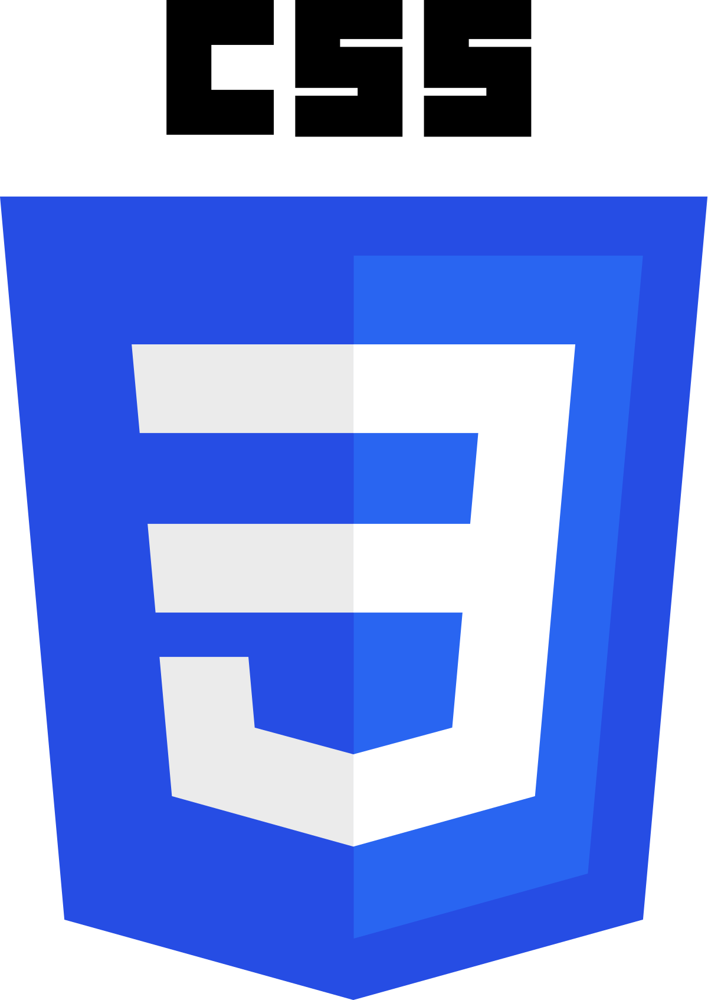

<table><tr>  <td>You are visitor</td>
    <td></td>
  </tr>
</table>

 

<!--/* [(https://forthebadge.com)*/ -->

### Hi I'm Suraj 

I am currently pursuing a Diploma in Computer Science and Engineering (CSE) at Ambekeshwar Institute of Technology and Management, Lucknow, with plans to pursue a B.Tech degree in the future. I am passionate about technology, graphic design, and event management.

I have experience in programming languages like C, Java, HTML, CSS, and Python, and I enjoy using tools like Adobe Photoshop for graphic design. My hobbies include photography, gaming, volleyball, and creative projects.

I have demonstrated leadership skills by successfully managing events and receiving awards such as the "Electron Award." I have also completed NCC training and National Level Physical Training, highlighting my discipline and teamwork abilities.

Balancing studies, fitness, and creative interests, I am always eager to take on new challenges and grow both personally and professionally.

  

### Pleased to meet you 

- 🔭 I’m currently working on <b>Web Development</b>
- 🌱 I’m currently learning <b>C</b>
- 👯 I’m looking to collaborate on <b>Projects on Python </b>
- 🤔 I’m looking for help with <b>syn606</b>
- 💬 Ask me about <b>Anything</b>
- 😄 Pronouns:<b>He/him</b>
- ⚡ Fun fact: <b>I ❤️ S</b>

## Languages and Tools : 

<table>
    <tr>
        <td></td>
        <td></td>
        <td></td>
        <td></td>
        <td></td>
        <td></td>
        <td></td>
        <td></td>
        <td></td>
        <td></td>
        <td></td>
        <td></td>
        <td></td>
        <td></td>
        <td></td>
        <td></td>
    </tr>
</table>

*NOTE: Top languages does not indicate my skill level or something like that, it's a github metric of which languages i have the most code on github, it's a new feature of [github-readme-stats]*

       

## Find me around the web  :
- Practicing Coding Skills in <a href="https://leetcode.com/u/officialsurajarya/">Leet Code.</a> 
- Personal Website <a href="https://officialsurajarya.github.io/">Suraj Arya</a> 🏓
- Sharing updates on <a href="https://www.linkedin.com/in/suraj-arya/">LinkedIn</a> 💼
- My Social Life <a href="https://www.instagram.com/officialsurajarya">Instagram</a> 💞

*<b>I love connecting with different people</b> so if you want to say <b>hi, I'll be happy to meet you more! :)</b>*
